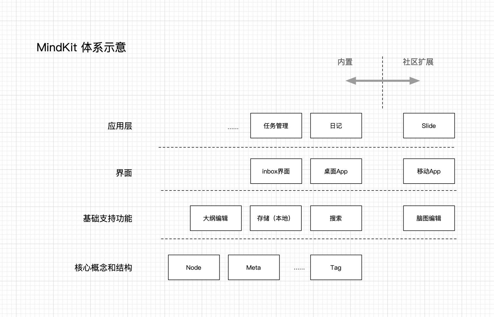

# MindKit - 如何工作？

MindKit体系设计如下图所示。

主要划分为以下四个层次，后续章节将每个层面具体介绍。

1. 核心概念和数据结构
2. 基础支持功能
3. 界面
4. 应用层扩展

### 核心概念和数据结构

本层次规定了业务（知识管理）核心概念和支持其的信息结构。

[@mind-kit/note-data](/noteData)

### 基础支持功能

本层次提供了支持业务运行的基本功能。体现了对工具集的功能的定位。这一层次（包括其之上的各层次）会内置部分实现，其他实现留给社区，或者远期。

内置的支持功能如下 - 

1. 大纲编辑器 - [@mind-kit/outline-editor](/outlineEditor) 
2. 本地存储机制 - [@mind-kit/store](/store) 
3. 特别支持中文和树形结构的搜索  - [@mind-kit/search](/search)

社区扩展可能的有 - 

1. 其他形式存储，比如支持共同编辑的在线存储形式。
2. 其他形式的编辑，比如脑图

### 界面

将功能组合在一起形成可运行的程序的层次称为界面。

内置界面有 - 

1. 桌面App - [@mind-kit/model](/model)
2. inbox - 紧密集合操作系统，强调快速录入想法片段的界面（TODO）

社区扩展可能有 - 

1. Viewer，各种类型的快速浏览界面。
2. 适应各种端特别是移动端的界面。

### 应用层扩展

应用层扩展实现基于知识管理的扩展业务逻辑，比如任务管理、账目、日记等等。此类扩展可能会有专属的功能和界面，但多使用现成的支持功能和界面层组合实现。

（详细扩展机制在归纳整理中）

内置应用扩展有 - 

1. 日记 - [@mind-kit/daily](/daily)
2. 任务管理 - [@mind-kit/todo](/todo)

社区扩展可能有（很多） -

1. 展示，写作类应用。

2.  有些扩展可能不是一个完整业务，是一个其他业务的扩展，比如甘特图，是任务管理业务的一个扩展。

   

